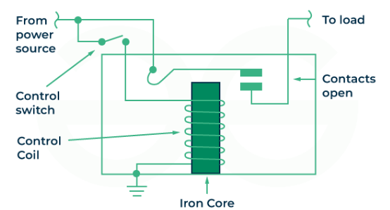
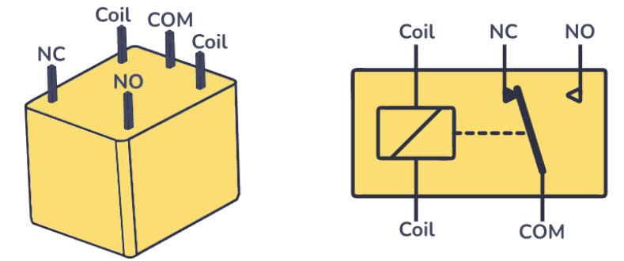
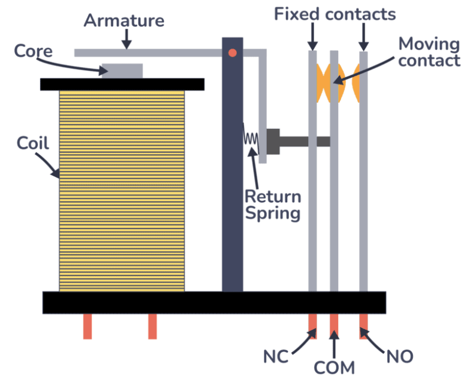

## **Relays** 
relay an electrically operated switch activated by an electromagnet which pulls a set of contacts to make or break a circuit. It uses a small electrical signal to control a large electrical circuit. They use them to turn on/off high-power devices like lamps or garage door motors with just a small DC voltage signal.
**Construction**:

A basic electromechanical relay is constructed using an electromagnet, a movable armature, and a set of contacts. The electromagnet, made of a coil and an iron core, creates a magnetic field when energized. This field pulls the armature, which in turn activates or deactivates the contacts, controlling a circuit.
**Inside the relay:**

The _coil_ pins control the switch, and the _NC_, _NO_, and _COM_ pins make up the switch.

A coil wound around a magnetic core makes up an electromagnet. It generates a magnetic field around it when an electrical current passes through the coil.
The armature is a movable component within the relay. When the coil is energized, the magnetic field it produces attracts the armature, causing it to move.
The return spring is connected to the armature, providing a restoring force when the coil is de-energized. It ensures that the armature returns to its original position when the electrical current through the coil ceases.
Attached to the armature through the return spring, the moving contact physically moves with the armature. When the armature is attracted by the energized coil, the moving contact changes its position, either making or breaking contact with the fixed contacts.
Fixed Contact – Normally Closed (NC): The NC contact is closed (connected to COM) when the relay is not energized.
Fixed Contact – Normally Open (NO): The NO contact is open (disconnected from COM) when the relay is not energized.
In a relay, the "COM" (Common) pin serves as a shared connection point for the Normally Open (NO) and Normally Closed (NC) contacts. When the relay is deactivated, the COM pin is connected to the NC contact, and when the relay is activated, the COM pin switches to connect with the NO contact.

**Single Phase SSR:**
A single-phase SSR is an electronic switching device used to control AC or DC loads in single-phase systems without any moving parts. It uses semiconductor components like triacs (for AC) or MOSFETs (for DC), triggered by a low-voltage DC control signal through an optocoupler, which ensures electrical isolation between the control and power sides. These relays are commonly used in applications like electric heaters, LED lighting, fans, and small automation circuits due to their fast response, silent operation, and long lifespan. They often include zero-cross switching for AC loads to minimize electrical noise and component stress. However, they typically require heat sinks to manage heat dissipation during prolonged or high-current operation.

**Three Phase SSR**
A three-phase SSR is designed to control high-power three-phase AC loads by simultaneously switching all three phases (L1, L2, L3) using internal semiconductor components such as anti-parallel thyristors or triacs. Triggered by a low-voltage control signal and isolated via optocouplers, these relays are ideal for industrial applications like motors, pumps, HVAC systems, and machinery that operate at higher voltages (400–480V). They provide noise-free, fast, and maintenance-free operation with superior resistance to mechanical wear, vibration, and arc damage. Due to the high currents involved, proper heat dissipation through large heat sinks or fan-cooled systems is crucial to ensure safe and reliable operation over time.
## Pin Connections:
Normally Open (NO) Pin Connection: If you want the device that you want to switch on/off to be disconnected from power when the relay is not activated, you need to use the normally open (NO) pin. As soon as the relay coil receives power, the switch closes, completing the circuit and allowing electricity to flow through it so that whatever you’ve connected turns on.
![[NormallyOpen.png]]
Normally Closed (NC) Pin Connection: If you want the device that you want to control to be connected to power when the relay is not activated, you need to use the normally closed (NC) pin. As soon as the relay coil receives power, it causes the switch to open, interrupting the circuit and stopping the flow of electricity to your device.
![[NormallyClosed.png]]
## Relay Switch types:
* SPDT Relay: _Single Pole Double Throw (SPDT)_. It’s the most commonly used. It’s a 5-pin relay with the following pins:
  The _COM_ pin is always used. And although you can use both _NC_ and _NO_, it’s common to use just one of them.
  ![[SPDT.png]]
* Single Pole Single Throw (SPST) : This relay has one normally open (NO) and one common (COM) contact. It can either connect or disconnect a single circuit.
* Double Pole Single Throw (DPST) : DPST relays feature two sets of contacts, each set capable of controlling a single circuit. Both switches can be open or closed simultaneously.
  * Double Pole Double Throw (DPDT) : DPDT relays have two sets of contacts, each set capable of controlling two separate circuits. It provides a double-throw functionality for each of the two poles.
    
## Types of Relays:
1) **Latching Relay**: Latching relays are commonly used in low power consumption or high temperature applications where applying coil power for a long time cannot be afforded due to power consumption or self heating of the coil. Instead of a continuous voltage applied to the coil, they are operated with short voltage pulses instead. Latching relays change contact position when a coil voltage is applied and remain in that position even if the voltage is disconnected. 
   They are characterized by their bistable operation, meaning they have two stable positions: set (on) and reset (off).
   A latching relay maintains its most recent state or position even when the signal that activated it is no longer present. It can stay in the 'on' or 'off' state without a constant power supply. Once triggered, its position is 'latched' into place. The latching relay can be operated manually, remotely, by impulses, or using different control inputs.
   **Working:**
   The operational mechanism of a latching relay is fundamentally similar to that of a conventional relay, with the key difference being that it does not require a continuous power supply to remain in an energized state. Current pulses are utilized to activate (trigger) and deactivate (reset) the relay, facilitating its transition between states or positions.
   **Types:**
   * **Single coil and dual coil:** These are the most common type, using electromagnetism to hold the contacts in their position. Single coil type requires a pulse of current in one direction to activate and another in the opposite direction to reset. Dual coil type controls one state (activation or reset), independent of polarity (discussed in the next section).
   * **Magnetic:** Magnetic latching relays use permanent magnets to maintain their position after being actuated. They can be either single or dual-coil operated. The permanent magnet holds the armature in the last position it was moved to by the coil.
   * **Mechanical:** Mechanical latching relays use a ratchet and pawl mechanism to maintain the position of the contacts. The relay is set or reset by moving the pawl with a pulse to the coil.
   * **Electronic (solid-state relays):** These are not traditional electromechanical relays but use semiconductor devices to perform the latching function without moving parts. They maintain their state using electronic circuitry rather than a mechanical mechanism.
   **Applications:** Utility meters, portable medical devices, security systems.
2) **Reed Relay:** A reed relay is a small electromagnetic switching device. Reed relays are made by placing a coil around one or more reed switches. A reed switch uses simple magnetic interaction to open and close it's contacts. And they consume in their normally open state.![[ReedRelays.png]]
   There are four contact forms, Form A, B, C, and E.
   First, is the Form A type which is the most common and rests in a normally open (N.O.) switch state. **Form A relays** remain OPEN or OFF until current passes through the coil. The electromagnetic coil produces a magnetic field equal to a permanent magnet. Finally, the resulting magnetic field closes the contacts, switching the relay ON. Conversely, when the coil current is removed, the switch turns off and the contacts return to their open state.
   Next is our second type Form B relays which have normally closed (N.C.) biased contacts held by a magnet. So, the relay rests in the closed or off state until the coil is energized, opening the contacts. De-energizing the coil switches the relay back to its closed or off position.
   Third, is the **Form C** **relay** which is uniquely comprised of three contacts compared to the typical two. They are normally open, normally closed, and common. The common contact will swing from the closed contact to the open contact when switched on. When OFF the contact reverts to its resting closed state. Therefore, Form C types are also referred to as a double throw switch.
   The fourth and final type **Form E** is what we call a latching or bistable relay. This relay can exist in either the N.O. or N.C. state with no coil power using a biasing magnet. The relays’ contacts maintain their last assumed position without activating the coil. To change the state of the contacts, the magnetic field must be reversed.
   **Applications:** Hybrid & Electric Vehicles
3) **Polarized relay :** Polarized relays have contacts that are polarized to ensure proper operation in DC circuits. They are designed to prevent reverse polarity issues.
4) **High-Frequency Relay:** These relays are designed to operate reliably at high frequencies, making them suitable for applications where the cycle of on/off occurs in short periods.

## **Solid-state Relays**

References:
https://www.youtube.com/watch?v=fV2xfSWcVZg
https://www.build-electronic-circuits.com/solid-state-relay-ssr/
https://www.ia.omron.com/support/guide/18/introduction.html

A Solid-state relay (SSR) is an electronic switch without moving parts that use semiconductor technology to turn things on and off.
## Working: 

To understand how SSRs work, take a look at following diagram that shows what an SSR looks like on the inside:

The SSR has three main components:
- A Light-emitting device
- A light sensor (ex a photodiode)
- A switching device (ex a transistor)
When a control signal (e.g., 5V DC) is applied to the input terminals of the SSR, it powers the LED. When the LED turns on, the light is detected by the light sensor on the output side and turns on the switching device so that current can flow.
This isolates (electrically) the low-voltage control side from the high-voltage load side. Such a setup is called an _optocoupler_.
The light sensor activates the trigger circuit, turning on the switching device in the output circuit, thereby connecting the power source to the load. The switching device remains on as long as the control signal is present, keeping the load powered. When the control signal is removed, the LED turns off, the light sensor stops detecting light, the trigger circuit deactivates the switching device, and the load is disconnected from the power source.
The switching device can be a MOSFET transistor, an IGBT, a Triac, or an SCR, depending on the type of SSR you are working with.

Step 1: Control signal is sent to input side
The operation of a Solid State Relay begins when a **control signal**, typically a low-voltage DC (such as 5V or 12V), is applied to the input terminals of the SSR. In some models, AC control signals are also supported. This signal usually comes from a digital controller like an Arduino, PLC, or microprocessor. The purpose of this signal is not to power the load directly, but simply to "tell" the SSR when to switch on or off.
In SSRs little current is required at the control input. The current needed is typically in the range of a few milliamperes which is enough to power a small internal LED in the optocoupler. This makes SSRs compatible with low-power control systems while still being capable of switching heavy loads on the output side.
SSRs rely on a non-contact method of switching. This means that once the signal is applied, there are no clicks or movements, and the switching happens silently and nearly instantaneously.
The input side is typically designed to accept a specific voltage range. Applying a voltage within this range activates the next stage in the relay, the **opto-coupler**.

Step 2: Opto-coupler activates the semiconductor switch
Once the control signal reaches the SSR, it powers a LED inside an opto-coupler. The opto-coupler is a critical safety and performance component. The LED emits infrared light, which travels a tiny gap within the component and strikes a light-sensitive semiconductor like a phototransistor on the other side.
This optical transmission serves two major purposes:
1. Electrical Isolation ensures that the low voltage control circuit is completely isolated from the high-voltage power circuit, preventing any backflow of current or dangerous voltage spikes.
2. Signal Transfer: The light from the LED “commands” the switching element on the output side to conduct electricity.
Once activated by the light, the phototransistor sends a small signal to trigger the power semiconductor switch such as a triac, thyristor, MOSFET, or transistor. The choice of semiconductor depends on whether the SSR is for AC or DC applications.
This triggering step takes just microseconds. allowing SSRs to switch much more quickly than mechanical relays. There's no physical wear and tear, so the relay can be used for millions of switching cycles with consistent performance.

Step 3: Load circuit closes and current flows
Now that the power semiconductor is triggered, the SSR completes the circuit on the output side. This implies the "switch" is now ON, and current is allowed to flow through the load which could be a lamp, heater, motor, solenoid, or other device.
For DC loads, the semiconductor (like a MOSFET or BJT) acts as a unidirectional switch. When it's turned on, it allows current to pass from the positive terminal to the negative terminal, just like a traditional transistor switch.
For AC loads, things get slightly more complex. Here, triacs or back-to-back SCRs (thyristors) are used. These components can handle the alternating nature of AC current which means they can conduct during both the positive and negative halves of the AC sine wave. Once turned on, they will continue conducting until the current naturally drops to zero at the end of each half-cycle.
The result is a completely closed circuit on the output side, with electrical current flowing efficiently and silently. During this stage, no mechanical contact is made, which means there is no arcing, sparking, or noise. This makes SSRs ideal for use in environments where reliability and quiet operation are essential.

Step 4: Zero-cross switching in AC SSRs
In alternating current (AC) systems, the voltage constantly swings between positive and negative values in a smooth, wave-like pattern called a sine wave. During every cycle of this waveform, the voltage reaches zero volts twice, once when transitioning from positive to negative, and once when going from negative to positive. These moments are called "zero-crossings".
Now you want to turn ON an AC-powered load like a lamp or a heater. If you close the circuit at the peak of the voltage (like 230V), the sudden surge of current can be harsh and damaging, especially for sensitive or inductive loads like motors. This sudden inrush can:
- Generate high electrical noise (EMI),
- Stress the internal components of the SSR and load,
- And shorten the lifespan of the devices involved.
To solve this problem, many AC SSRs include a zero-cross detection circuit that ensures switching occurs only when the AC voltage is at or near 0V which is a very calm, low-energy moment in the cycle. This is called zero-cross switching.
## Types:
Classification depends on the **type of input signal you can apply and the type of load you can control**.
- DC-to-AC
- AC-to-AC
- DC-to-DC
- DC and AC output
### DC-to-DC SSR
A DC-to-DC SSR would allow you to use a low-voltage DC signal to control another DC device. These relays typically use switching devices like MOSFETs or IGBTs transistors at the output to control the flow of current in the DC circuit. Take a look at its circuit:

### DC-to-AC SSR
With this kind of SSR you can use a low-voltage DC signal to control a device that runs on AC power. A DC-to-AC SSR relay typically has a Triac or SCR (Silicon Controlled Rectifier) at the output. These components are used to switch the AC load on or off when they receive the signal from the control circuit. You can check its internal diagram below:

   
### AC-to-AC SSR
The AC-to-AC SSR, along with the components previously mentioned, such as the led, the light sensor and the Triac or SCR at the output, there’s a rectifier bridge in the input circuit. This rectifier bridge is responsible for converting the AC control signal into a form that can be used to activate the relay and control the AC load.

### DC and AC Output SSR
These relays are useful when you need to control both DC and AC devices or circuits using the same control signal. They typically incorporate different types of switching components for DC and AC output, such as MOSFETs or IGBTs for DC and Triacs or SCRs for AC.

## Types of SSR Configuration

Various SSR packaging/integration styles:

**Integrated with Heat Sink**  
→ Heat sink pre-attached by manufacturer  
→ Ready for high current & continuous load  
→ Easy to install, no extra cooling needed  
→ Used in industrial & heavy-duty applications
The integrated heat sink enables a slim design. These relays are mainly installed in control panels.
![[relay1.png]]

**Separate Heat Sink**  
→ Heat sink sold separately  
→ User attaches suitable heat sink based on load  
→ Flexible for different power and space needs  
→ Common in customizable industrial setups
Separate installation of heat sinks allows the customers to select heat sinks to match the  
housings of the devices they use. These relays are mainly built into the devices.
![[Pasted image 20250529130816.png]]

**Relay-Shaped SSR (Mechanical Lookalike)**  
→ Same size and pin layout as mechanical relays  
→ Easy drop-in replacement in existing systems  
→ Fits relay sockets or DIN rails  
→ Offers silent, maintenance-free switching
These relays have the same shape as plug-in relays and the same sockets can be used. They are usually built into control panels and used for I/O applications for programmable controllers and other devices.
![[Pasted image 20250529130928.png]]

**PCB-Mounted SSR**  
→ Compact size for soldering directly on PCB  
→ Lower power rating than panel-mount SSRs  
→ Ideal for embedded systems and small circuits  
→ Saves space and simplifies assembly
![[Pasted image 20250529131023.png]]

## **Optocoupler**
References: https://www.nutsvolts.com/magazine/article/optocoupler-circuits
An optocoupler, also known as an optoisolator or photocoupler, is an electronic device made up of an LED emitter combined with a photodetector, separated from each other in proximity.

**Uses**
Optocouplers manage to send signals between circuits with separate grounds, providing an isolated galvanic barrier between them. Therefore, an optocoupler is a solution for circuits that need to be isolated from each other for safety or regularity reasons and need to have interaction in between.
1. **Preventing Ground Loops in Remote Equipment:**  
Sometimes, electronic equipment in one place needs to control something far away. If both devices are connected directly through wires, it can create unwanted loops in the electrical ground path. This can cause noise, errors, or even damage. Optocouplers help by keeping the control and power sides completely separate. They pass signals using light instead of direct wires, so there’s no electrical connection — just clean, safe control. That’s why they’re widely used in power supplies for computers and communication devices.
2. **Reducing Electrical Noise:**  
Digital circuits (like microcontrollers or computers) can create electrical noise which means little bursts of unwanted signals. If this noise gets into the part of your circuit that measures things, like a sensitive sensor or ADC (Analog-to-Digital Converter), it can ruin the accuracy. Optocouplers act like a noise-blocking wall between the digital and measuring parts. They send the signal through light, which doesn’t carry that unwanted noise, keeping your readings clean and accurate.
3. **Safely Sending Signals to High-Voltage Circuits:**  
In some electronic designs, you need to send a signal to a part of the system that’s working at a very high voltage. Connecting to it directly would be dangerous. Instead, optocouplers send the signal using light, without any direct contact. This way, you can control high-voltage circuits safely from a low-voltage side, which is especially useful in power supply designs and electric motor control.

## Working:
![[Pasted image 20250529134832.png]]
First, the current is applied to the optocoupler, which causes the LED to generate infrared light proportional to the current flowing through it. When light strikes the photosensor, it conducts a current and turns on. The IR beam is switched off when the current running through the LED is disrupted, forcing the photosensor to stop conducting. The photosensor is the output circuit that detects light, and the output is either AC or DC depending on the type of output circuit.
The output of an electrically isolated circuit is controlled by adjusting the circuit’s input, which is the basic operating concept of an optocoupler. A voltage source provides input to the Infrared LED, and the intensity of the voltage source can be varied by altering the input voltage. The light emitted has a specific wavelength. This light is detected by the photodetector, which turns light energy into photocurrent. The generated output current is then amplified. The output current is proportional to the amount of light that strikes the device.

## Configurations
In DC circuits, **photo-transistor** and **photo-Darlington** are commonly utilized, whereas **photo-SCR** and **photo-TRIAC** are commonly employed to control AC circuits.
![[OctocouplerConfigurations.png]]

## **Digital interfacing**
Optocoupler devices are ideally suited for use in digital interfacing applications in which the input and output circuits are driven by different power supplies. They can be used to interface digital ICs of the same family (TTL, CMOS, etc.) or digital ICs of different families, or to interface the digital outputs of home computers, etc., to motors, relays, and lamps, etc. This interfacing can be achieved using various special-purpose ‘digital interfacing’ optocoupler devices, or by using standard optocouplers.

**TTL Interface**
![[TTLInterface.png]]
The circuit in this figure is used to safely connect two digital (TTL) circuits using a device called an **optocoupler**. An optocoupler sends signals using **light instead of direct wires**, which protects the two circuits from damaging each other.
In this setup, the **first TTL circuit** controls an LED (inside the optocoupler). But TTL outputs are **better at pulling signals down to 0 volts** than pushing them up to 5 volts. That’s why the LED is connected between **5V and the output pin** of the first TTL chip. This way, when the output goes **LOW**, it allows current to flow through the LED, turning it **ON**. When the output goes **HIGH**, the LED should turn **OFF**.
However, there's a problem: TTL outputs sometimes don’t go all the way up to 5V—they might stop at around **2.4V**, which might not be enough to fully turn the LED off. To fix this, a **pull-up resistor** is added to help pull the voltage up to 5V properly so the LED fully turns off when needed.
On the other side of the optocoupler is a **phototransistor**. When the LED is ON, light turns on this transistor, which **pulls the second TTL input LOW**—this tells the second circuit it’s getting a "0". When the LED is OFF, the transistor is OFF, and the input stays HIGH—meaning it's a "1". This setup cleanly passes the signal from one circuit to another without direct contact and keeps the logic (0 or 1) the same.

**CMOS Interface**
![[Pasted image 20250529141047.png]]
**CMOS ICs** (another type of digital chip) are better than TTL in one big way: they can **both pull the signal up and down** equally well. This means they can **push current out (source)** and **pull current in (sink)** with similar strength, usually a few milliamps.
Because of this, you have **two choices** when using a CMOS chip to control an optocoupler:
1. **Sink configuration** (like in TTL Interface): The LED is between the 5V line and the CMOS output, so the CMOS chip pulls current **down** through the LED when it goes LOW.
2. **Source configuration** (like in CMOS Interface): The LED is between the CMOS output and ground, so the CMOS chip pushes current **up** through the LED when it goes HIGH.
Both methods work well with CMOS because it’s strong in both directions. But in either setup, there’s a resistor (called **R2**) in series with the LED. This resistor’s job is to **control the current** and **make sure** the voltage at the output moves all the way between logic-0 and logic-1 (usually 0V and 5V). If the resistor is too small, the voltage might not swing fully, which could cause incorrect operation. So, R2 needs to be **large enough** to keep things working properly.

## **Analog Interfacing**
![[AudioCouplingCircuit.png]]
An optocoupler can also be used to transfer analog signals, like audio, from one circuit to another while keeping them electrically isolated. Figure 17 shows how this is done using an op-amp and an optocoupler.

In this circuit, the op-amp is set up as a voltage follower—this means it copies the voltage you give it at the input (pin 3) to the output. The special part is that the LED inside the optocoupler is placed in the feedback path of the op-amp. This makes the current through the LED follow the input voltage exactly. The input is biased (set) at half the supply voltage using two resistors (R1 and R2), so the signal can swing up and down around this middle point. An audio signal is added on top of this bias using a capacitor (C1), which blocks DC and lets the changing (AC) part of the signal through. The resistor R3 sets a steady (quiescent) current of 1–2 mA through the LED when there's no audio signal.

On the output side of the optocoupler, the phototransistor responds to the light from the LED. It creates a small current that flows through RV1, a variable resistor (potentiometer). This sets a steady voltage (quiescent voltage) across RV1. You adjust RV1 so that this voltage sits at about half the supply, just like the input. As the LED current changes with the audio signal, the phototransistor current also changes, creating a matching audio signal across RV1. Finally, a capacitor (C2) removes the DC part of the signal, so only the clean audio comes out.

## **Triac Interfacing**
![[Pasted image 20250529141711.png]]
A great use of an **optocoupler** is to connect a **low-voltage control circuit** (like from a microcontroller or switch) to a **high-voltage AC circuit** that controls things like **lamps, heaters, or motors**. This keeps the low-voltage side safe from the dangerous high-voltage side.
Figure 18 shows a circuit that does this using a **triac** (a device that switches AC power). It uses an **optocoupler** to safely turn the triac **on or off**.
Here’s how it works:
- The circuit makes its own **10V DC supply** from the AC mains using components like **R2, D1, ZD1, and C1**.
- This 10V is used to control the triac through a transistor **Q1**.
- When the switch **SW1 is open**, the optocoupler is OFF, Q1 is OFF, and the triac does nothing—so the **load (lamp, heater, etc.) stays OFF**.
- When **SW1 is closed**, the optocoupler turns ON, which turns **Q1 ON**, sending the 10V to the **triac gate** through resistor R3. This turns the **triac ON**, allowing **AC power to flow** to the load.
Note: This is a **non-synchronous** switch, meaning the triac turns on at any point in the AC wave, not just at zero voltage crossing.

## Structure
![[Pasted image 20250529135257.png]]
An optocoupler is made up of two electrically isolated circuits. The first circuit has an infrared emitting diode, whereas the second circuit contains an infrared sensor device, such as a photodiode, phototransistor, photo TRAIC, or photo SCR. Glass, air, or translucent plastic can be used to fill the space between the two circuits. The light is emitted by the LED, and it is received and amplified by the phototransistor. The anode and cathode of the LED are the first and second pins, whereas the emitter and collector of the phototransistor are the third and fourth pins.

## Applications

Optocouplers can either be used on their own as a switching device or with other electronic devices to provide isolation between low and high-voltage circuits. You’ll typically find these devices being used for:

- Microprocessor input/output switching
- DC and AC power control
- Communications equipment protection
- Power supply regulation
