Some things you should know:
- Header file library
  Instead of writing everything from scratch like how to print, calculate cube roots, sort data we can use these predefined/user-defined libraries, which provide functions, classes, and objects.
  examples,
  - iostream - cin (input), cout (output)
  - cmath - sqrt(), pow()
  - string - gives access to common std::string functions like - .length(), .empty(), .append()
- using namespace std; - removes the need to write std:: every time
- main() - anything inside the {} after this is executed and output is given based on return type - for example, int main() returns 0 if everything goes well.
- console output - cout - used to print text or data on the screen
- << - insertion operator - sends data into cout
- return 0; - sends a signal that program ran well
- \n - newline
- endl; - newline + flushes output buffer (sends everything in buffer immediately to the screen)
- //comment - single line comment -> multi-line comment - /* commenting commenting commenting*/
- Variable : syntax : **_type variablename = value_**
  - int - integers (2 or 4 bytes) : 173, -173 
  - double - floating point numbers (4 bytes) : 13.77, -17.33
  - char - (1 byte): 'p', 'Q', 'r'
  - string : "What is this?"
  - bool - boolean : true or false
- Identifiers - names you give to variables, functions, classes, objects
- Constants - read-only variables
  example,
  const int a = 17;
  a = 13; --> this is shown as error statement when you run it
- cin - console input - used to extract info from user
- auto - keyword which automatically detects the type of variable based on value assigned
- while vs do-while - in do-while the loop at-least runs once

1. Printing a message
- without using namespace
  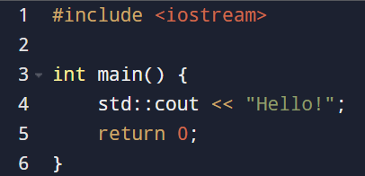
  output : Hello!
- using namespace
  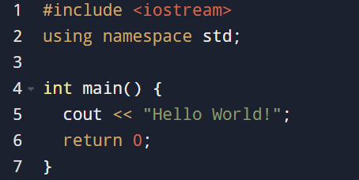
  output : Hello World!
- printing a number
  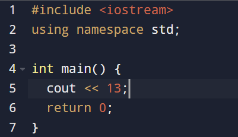
  output : 13
2. Algebraic functions
   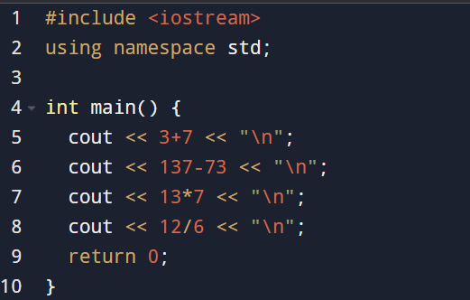
   output: 
   10
   64
   91
   2
3. \n vs endl;
   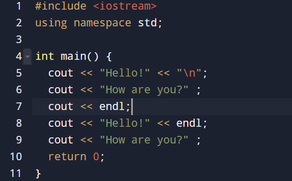
   output:
   Hello!
   How are you?
   Hello!
   How are you?
4. Variables
   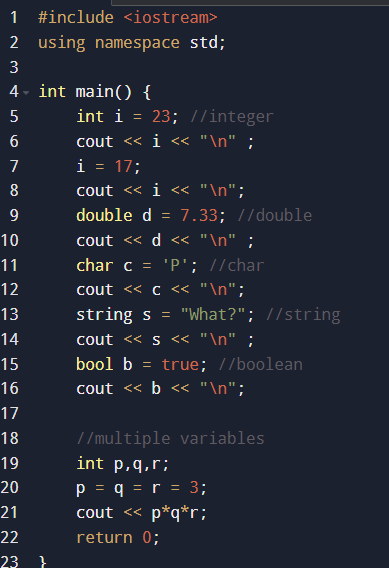
   output:
   23
   17
   7.33
   P
   What?
   1
   27
5. Area of a square
- 
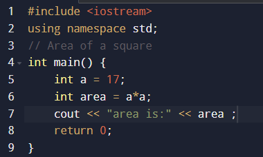
- using user input
  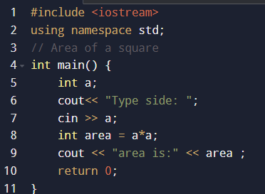
   output: 289
6. String
 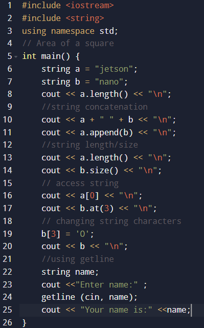
 output: 
 6
jetson nano
jetsonnano
10
4
j
o
nanO
Enter name:Priya D
Your name is:Priya D
7. Math
   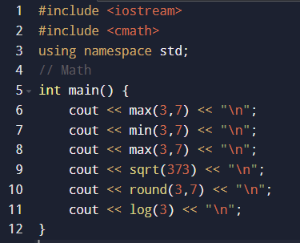
   output:
   7
   3
   7
   19.3132
   4
   1.09861
8. if statement   
   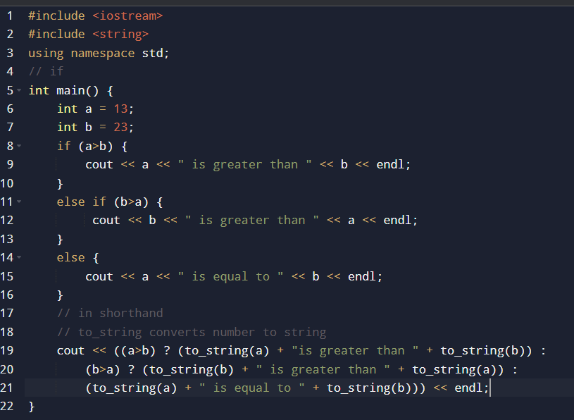
   output:
   23 is greater than 13
   23 is greater than 13
9. Switch
   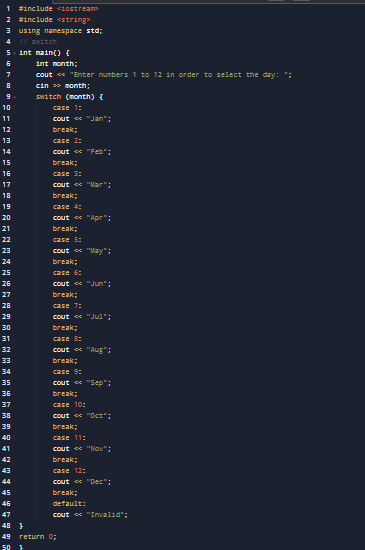
   output:
   Enter numbers 1 to 12 in order to select the day: 3
   Mar
10. while
    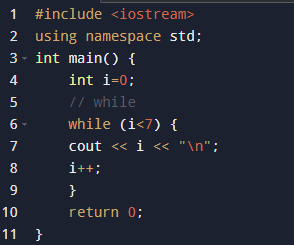
    output
    1
    2
    3
    4
    5
    6
11. do-while
    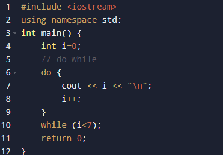
    output:
    0
    1
    2
    3
    4
    5
    6

