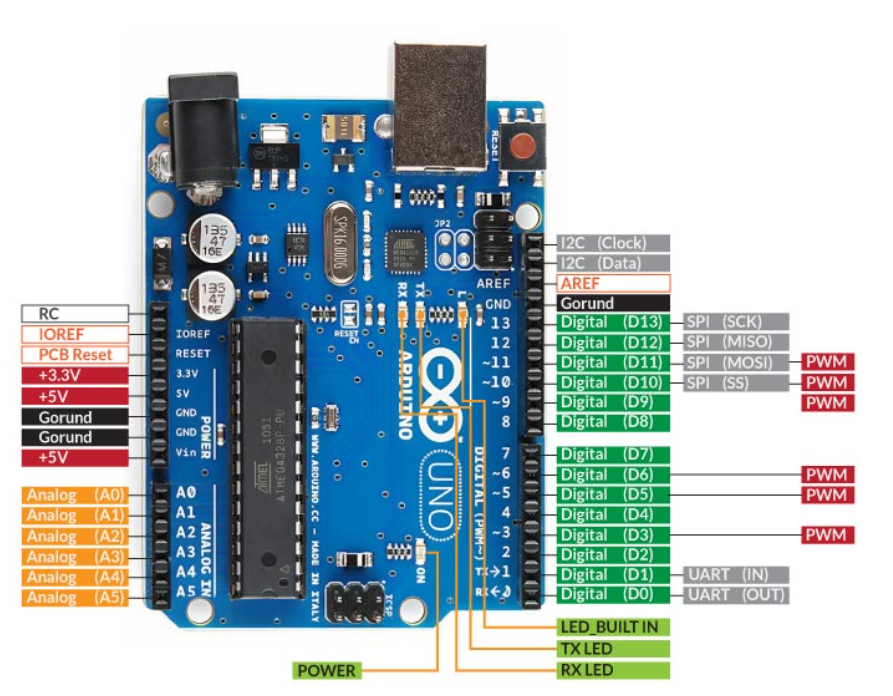
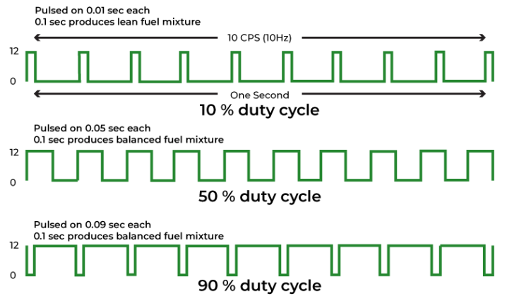
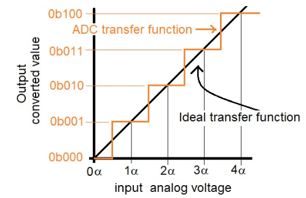

Difference between a microprocessor and microcontroller?
- *Microprocessor* 
	- CPU of a computer
	- Only processing unit, no memory or input/output features built in. 
	- Example, intel i7
	- It needs external RAM, ROM, timers, and I/O peripherals to function.
	- Used in general purpose computing tasks (e.g., laptops, desktops)
- *Microcontroller* 
	- Complete mini-computer on a single chip. 
	- Includes CPU, RAM, ROM (flash memory), timers, ADCs, input/output pins. 
	- Example, *ATmega328P* (used in Arduino Uno)
	- Used in embedded applications, automation, robotics.
Arduino uses microcontrollers.

***Arduino***??
Arduino acts as a bridge between input devices (like sensors), and output devices (like LEDs, motors, etc) allowing control via uploaded code.
*Development board* that contains a microcontroller (like ATmega328P on Arduino Uno) and all circuitry necessary to connect and program easily.
It includes:
- USB interface - to upload code - USB port to connect Arduino to computer
- Voltage regulator - ensures it gets steady and safe voltage level even if you supply a higher voltage from an external source 
- I/O pins - physical pins on it that are used to connect sensors, LEDs, motors, buttons, etc.
- Headers for sensors and modules - female/male pin connectors on the board

*Function* of microcontroller in Arduino: 
It acts as a tiny brain that
- reads inputs (from sensors, buttons, switches)
- processes logic based on code uploaded
- controls output (like turning ON/OFF LEDs, running motors, displaying data)

*GPIO* pins - General Purpose Input Output Pins: 
Pins on Arduino which can be programmed to read input signals, send output signals. On Arduino, digital pins (D0 to D13), Analog pins (A0-A5).
- *Digital* pins : Only read/write 2 states - HIGH (1) or LOW(0) - preferred for buttons, LEDs
	  - Pins 0 (RX) and 1 (TX) - Reserved for serial communication
	  - Pins 2-13 - General purpose I/O pins
- *Analog* pins : Read a range of voltages (0-5V), converts it into a values (0-1023 using a 10 bit ADC) - preferred for sensors like temperature or light sensors.

*Power pins*: Essential for operating the board and connected devices. Main pins are:
- Vin - Accepts external power sources 
- 5V & 3.3 V - provide regulated voltage outputs for peripherals
- GND - Ground
- IOREF - supplies a voltage reference for i/o pins.

*Special function pins* : 
- Reset pin: Reserved board when triggered
- AREF: Used to provide external voltage ref for analog inputs.
- Serial Pins (RX/TX): Facilitate UART communication for serial data exchange.

*PWM* - Pulse Width Modulation:
This allows digital pins to simulate analog output by switching signal ON and OFF very fast. It lets control brightness of LEDs, motor speed, represent analog voltage using digital signals. In Arduino Uno, pins 3,5,6,9,10,11 support PWM.

Arduino IDE:
Software on computer to write Arduino code, verify/compile code, upload code on board via USB. A simplified version of C++ is used.

Arduino *Communication Protocols* :
- UART (Serial) - for USB/serial communication (TX/RX pins)
- I2C - used for connecting multiple sensors/modules using 2 wires (SDA,SCL)
- SPI - high speed communication using wires (MOSI (Master Output Slave Input) , MISO (Master Input Slave Output) , SCLK (Serial Clock Signal) , SS (Slave Select))

*Memory structure* of a microcontroller like ATmega328P:
3 main memory types:
- Flash memory - stores program/code - non-volatile
- SRAM - stores variables while program runs - volatile
- EEPROM - stores data permanently even after power-off

What happens when you connect Arduino to PC?
- Arduino is powered through USB.
- Arduino IDE detects board via a COM port.
- When you upload code, compiler converts sketch into machine code.
- The bootloader on Arduino stores code in flash memory.
- Arduino starts running code immediately.

Basic Arduino commands:
- pinMode (pin, INPUT/OUTPUT) : set the pin type
- digitalWrite (pin, HIGH/LOW) : sends output
- digitalRead (pin) : reads input
- analogRead (pin) : reads sensor value (0-1023)
- analogWrite (pin, value) : output PWM
delay (ms) : pauses the program

*Embedded system*: A computer built to do one specific job. Arduino is an embedded system.

Difference between delay() and millis() in Arduino:
- delay(ms) - Pauses the program for a number of milliseconds. During the pause nothing else runs = microcontroller waits.
example, delay(3000) pauses for 3 seconds.
- millis() - Gives the number of milliseconds that have passed since the board was turned ON.

*Interrupt* in Arduino:
It is like an urgent notification which allows the microcontroller to pause the current task and immediately run a special piece of code (called an ISR - Interrupt Service Routine) when a certain event happens. It allows the Arduino to respond immediately to important events (e.g., a change on a pin) without needing to constantly poll the input in the loop function. 

*Debouncing* in buttons:
When we press a mechanical button, the contact inside bounces for a few milliseconds, causing multiple HIGH/LOW signals. This can make Arduino think the button was pressed many times. Debouncing is filtering out these false signals, either in software (using delay or timing) or using hardware (capacitor + resistor).

Serial communication is how the Arduino talks to PC (or any other device) over a USB cable or through pins (TX and RX). It is essential for debugging, sending sensor data, receiving commands from software.

Use of *pull-up* and *pull-down* resistors: 
When a pin is floating, it can randomly pick up noise and show HIGH or LOW unpredictably. A pull-up or pull-down resistor forces the pin to default to HIGH or LOW.

Working of sensors and actuators with Arduino:
- Sensors collect data from the environment (light, temperature, motion).
	Example: 
	- DHT11 (temperature and humidity)
	- LDR (light sensor)
	- PIR (motion).
- Actuators do something in response to signals.
	Example:
	- LED (light up)
	- motor (rotate)
	- buzzer (make sound)
	- relay (switch high voltage).

*ADC* - Analog-to-Digital Converter: 
Arduino’s ADC takes a voltage signal (like from a sensor) and converts it into a digital value (0-1023 for 10 bit ADC).
ADC stands for Analog-to-Digital Converter. It converts an analog voltage (a continuous signal like from a temperature sensor or potentiometer) into a digital value (a number the microcontroller can understand).

*Feedback control*: 
When system monitors the output and adjusts itself to reach a goal. 
For example, fan turns on when T rises and slows down if it gets too cool.
It is a closed loop control system where the system's output is continuously monitored, compared to a desired setpoint, and used to adjust input in real-time to minimize error.
Arduino is perfect for basic feedback control. It reads values from sensors, decides what to do based on those values and adjusts outputs like motors, LEDs, etc.
Arduino can use feedback control in several situations. 
Line following robot - IR sensors (input) - motors (output) - follow black line using feedback.
Thermostat - T sensor - Fan/heater - maintains room temperature.

A more advanced one, for smoother, continuous adjustments is *PID Control* (Proportional-Integral-Derivative). It improves response time.

*Firmware*:
A special type of software that is permanently programmed into a hardware device. It tells the device how to operate (it lies btw hardware and higher level software).
In Arduino, ***firmware*** is the low level program that runs on the microcontroller, making it work as intended after it is programmed.
In Arduino, there are 2 types of firmware:
- *Bootloader*: Small program pre-loaded into microcontroller. It *allows new code to be uploaded to microcontroller without using an external programmer*. It is stored in *Flash memory* in microcontroller. It runs every time you power or reset the board. 
  example, ATmega328P chip on Arduino Uno has *Optiboot* bootloader.
- *USB-to-serial firmware* on a separate chip: Some boards have a second chip that acts as a USB-to-serial converter, example, ATmega16U2 on Arduino Uno. This chip also runs firmware that helps translate USB signals from your PC into serial data the main microcontroller understands. It allows the board to be recognized as a COM port on your computer. This firmware is factory-programmed and usually only updated when absolutely necessary.

*Timers and Counters* in Arduino:
**Timers** are internal hardware features of a microcontroller that count clock pulses at regular intervals and can perform specific actions at set times. They are the backbone of timing operations in Arduino used for generating precise delays, PWM signals, and triggering interrupts.
For example, functions like millis(), micros(), and delay() all rely on timers. ATmega328P has three timers - Timer0, Timer1, and Timer2.
- Timer0: 8-bit, used for millis() and delay() by default.
- Timer1: 16-bit, great for more precise timing like servo motor control.
- Timer2: 8-bit, often used for PWM.
Timers can also operate in CTC (Clear Timer on Compare Match) or PWM modes, and can trigger interrupts when certain conditions are met, enabling you to write real-time code that doesn’t rely on delay().
In CTC mode, the timer counts up until it hits a number you set (called the _compare value_), and then it resets back to zero automatically.   
You can also set it to trigger an interrupt when this match happens.
In PWM mode, the timer quickly turns a pin on and off repeatedly at a specific speed. You control how long it's ON vs OFF, which is called the duty cycle. This is great for fading LEDs, controlling motor speed, or creating analog-like signals using digital pins.

*Watchdog Timer* WDT :
A Watchdog Timer is like a built-in safety feature for the microcontroller. It keeps watching the code while it runs. If code gets stuck in an infinite loop, crashes, or hangs, and doesn’t reset the timer in time, the watchdog automatically resets the microcontroller. This helps the system recover from faults automatically without human intervention. Useful in long-running or unattended devices like weather stations, IoT sensors, industrial controllers.
In most Arduinos, the Watchdog Timer is a built-in hardware feature of the uc. It uses separate, internal oscillator, so it keeps working even if the main clock crashes. 

*Power/Sleep Modes* in Arduino:
Microcontrollers consume power even when idle. Instead of continuously polling or waiting using delay(), the MCU can enter a low-power state until an interrupt or event wakes it up. While asleep, the microcontroller halts the CPU and optionally other subsystems like ADC, Timers, USART, and even the System Clock, depending on the mode.

| Sleep mode             | Power Saved                            | What stays active?                                       | Wake sources                                        |
| ---------------------- | -------------------------------------- | -------------------------------------------------------- | --------------------------------------------------- |
| Idle                   | Low                                    | Timer/Counters, ADC, USART, SPI, I²C, WDT             | Timer, USART, I²C, external interrupt, WDT |
| ADC Noise Reduction | Medium                                 | ADC (for precision ADC sampling)                      | ADC complete interrupt, external interrupt       |
| Power Down             | High                                   | Only external interrupts, WDT, and Reset           | External interrupt, WDT, reset                      |
| Power Save             | Very High                              | Timer2 + Asynchronous modules                      | Timer2 overflow, external interrupt, WDT      |
| Standby                | Higher than Power Save              | Timer2 + Oscillator remains running                   | Same as Power save, but faster  wake-up       |
| Extended Standby    | Highest (But longest waste time) | Timer2 + Oscillator running with full context hold | Same as Standby                                     |
*Bit Manipulation*:
Bit manipulation is the act of directly setting, clearing, toggling, or checking individual bits in a byte or register using bitwise operators (&, |, ^, ~, <<, >>). It allows you to talk directly to the microcontroller hardware, bypassing slower, higher-level functions like digitalWrite() or pinMode().

*Fuses*:
Fuses are special configuration bits that control fundamental aspects of how the microcontroller operates. These include selecting the clock source (internal oscillator, external crystal, or resonator), setting the startup time delay, enabling or disabling the brown-out detector, and defining whether the watchdog timer is always on. Fuses are *non-volatile*, meaning they retain their settings even after the microcontroller loses power. Unlike regular program code, fuse settings are not changed during runtime they are set during programming and remain fixed unless explicitly reprogrammed.

*Lock bits*: 
Another type of low-level setting used to protect the microcontroller’s flash memory. They allow the developer to restrict external access to the firmware stored on the chip. This is particularly important for commercial or sensitive applications where reverse engineering or unauthorized duplication of the firmware is a concern. For example, setting lock bits can prevent someone from reading or overwriting the flash memory via an external programmer, effectively protecting the intellectual property encoded into the microcontroller.

*Clock System and Oscillators*:
Every microcontroller needs a clock to operate. The ATmega328P runs at 16 MHz using a crystal oscillator on Arduino Uno. It’s what determines how fast instructions are executed and how timers run. Some boards allow switching between internal and external clocks using fuses. For accurate timing, understanding the oscillator and clock division system is crucial especially for time-sensitive applications like communication or real-time control.

References:
https://components101.com/microcontrollers/arduino-uno