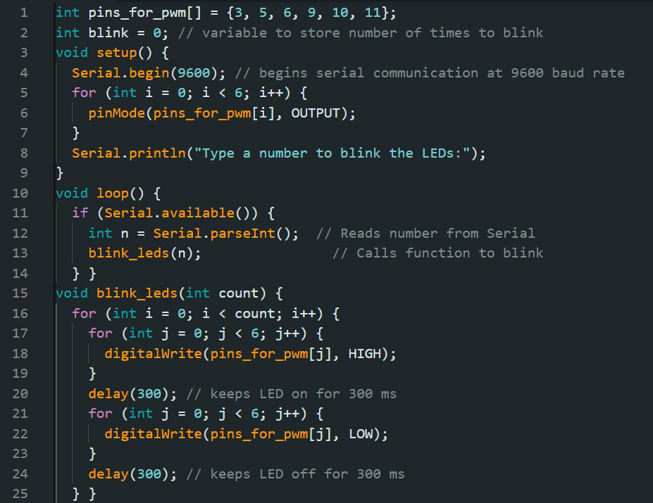
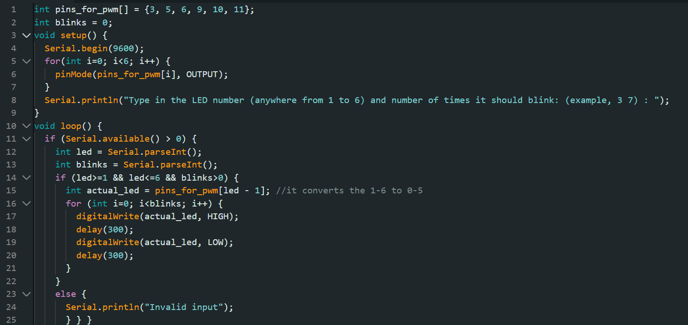

Some questions:

The *baud rate* is the speed of communication between your Arduino and your computer (via Serial Monitor).
Why 9600? Standard/ default baud rate.

A *serial port* is a communication interface that sends data one bit at a time, in a sequence serially from one device to another. It’s how your Arduino talks to your computer, and vice versa.

### PROJECT 4:

When I input a number (example, 5) in serial monitor in Arduino IDE, the 6 LEDs blink those number (example, 5) of times.

for example, 
Input in Serial Monitor: 7
Output:

### PROJECT 5:

When I input (LED_number Number_of_times_to_blink) (example, 1 5 ) in the serial monitor then the LED blinks the mentioned number of times.

for example,
Input on Serial Monitor: 3 7
Output:

